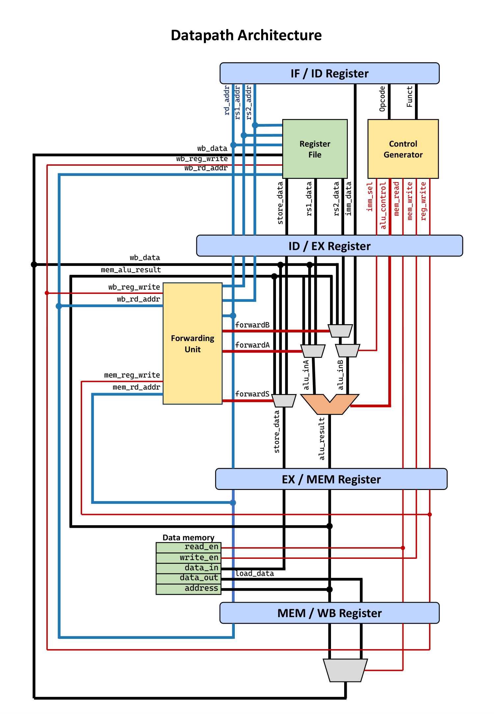

# 8-bit Five-Stage Pipelined Datapath with integrated ALU

A modular RTL implementation of an **8-bit five-stage pipelined datapath** in Verilog featuring an integrated ALU,  custom instruction set, pipeline registers, data forwarding logic for RAW hazard resolution, and functional verification using Xilinx Vivado.

## Project Overview

This project implements an **8-bit pipelined datapath with an integrated ALU** using Verilog RTL, following the classical execution model used in modern RISC architectures.
The design is organized into five pipeline stages,

**Instruction Fetch (IF) → Instruction Decode (ID) → Execute (EX) → Memory Access (MEM) → Write Back (WB)**

and supports arithmetic, logical, shift, and memory access instructions through a custom **16-bit instruction set architecture (ISA)**. A dedicated forwarding unit is implemented to resolve execution-stage **Read-After-Write (RAW) data hazards** by bypassing results from later pipeline stages.

The complete design has been functionally verified using behavioral simulation in **Xilinx Vivado** and follows a modular RTL structure where each hardware block is implemented as an independent Verilog module.

## Features

- Five-stage pipelined architecture:
  - Instruction Fetch (IF)
  - Instruction Decode (ID)
  - Execute (EX)
  - Memory Access (MEM)
  - Write Back (WB)

- Modular Verilog RTL implementation with independent hardware blocks.

- Integrated **8-bit ALU** supporting:
  - Arithmetic operations
  - Logical operations
  - Logical shift operations

- Custom **16-bit ISA** supporting:
  - R-type register instructions
  - I-type immediate instructions
  - Load and store instructions

- Dedicated **Data Forwarding Unit** for resolving execution-stage RAW hazards.

- Three forwarding paths:
  - `forwardA` → ALU operand A forwarding
  - `forwardB` → ALU operand B forwarding
  - `forwardS` → Store-data forwarding

- Four pipeline registers:
  - IF/ID
  - ID/EX
  - EX/MEM
  - MEM/WB

- Four condition flags:
  - Carry
  - Overflow
  - Sign
  - Zero

- Integrated:
  - Instruction Memory
  - Data Memory
  - Register File (`R0–R7`)

## Datapath Architecture

The following diagram illustrates the overall datapath architecture of the design. The datapath is organized into five pipeline stages connected through dedicated pipeline registers that store intermediate data and control signals, enabling multiple instructions to be processed simultaneously.

Signal paths in the datapath diagram are color-coded:

- **Red:** Control signals generated by the control unit.
- **Blue:** Address-related signals used for instruction and register selection.
- **Black:** Data paths carrying instructions, operands, and results.

<p align="center">
  
</p>

## Module Hierarchy

```text
top.v
│
├── IF Stage
│   ├── InstructionMemory.v
│   └── IF_ID.v
│
├── ID Stage
│   ├── Control.v
│   ├── RegisterFile.v
│   └── ID_EX.v
│
├── EX Stage
│   ├── ALU.v
│   ├── ForwardingUnit.v
│   └── EX_MEM.v
│
├── MEM Stage
│   └── MEM_WB.v
│
└── WB Stage
    └── WriteBack.v
```

## Pipeline Modules

| Module | Description |
|--------|-------------|
| `InstructionMemory.v` | Stores the instructions executed by the processor. |
| `IF_ID.v` | Pipeline register between Instruction Fetch and Instruction Decode stages. |
| `Control.v` | Decodes instruction opcode and generates required control signals. |
| `RegisterFile.v` | Implements the processor register file containing `R0–R7`. |
| `ID_EX.v` | Stores operands, addresses, and control signals before execution. |
| `ALU.v` | Performs arithmetic, logical, and shift operations while generating status flags. |
| `ForwardingUnit.v` | Detects data dependencies and forwards results to resolve RAW hazards. |
| `EX_MEM.v` | Stores execution results and control signals before memory access. |
| `MEM_WB.v` | Transfers memory-stage results and control information to write-back stage. |
| `WriteBack.v` | Selects the final value written into the register file. |


## Instruction Set Architecture (ISA)

The processor uses a **16-bit instruction format** and supports two instruction types:

- **R-Type:** Register-based operations
- **I-Type:** Immediate-based operations

#### R-Type Format

| Opcode | rd | rs1 | rs2 | funct |
|:------:|:--:|:---:|:---:|:-----:|
| 4 bits | 3 bits | 3 bits | 3 bits | 3 bits |

#### I-Type Format

| Opcode | rd | rs1 | Immediate |
|:------:|:--:|:---:|:---------:|
| 4 bits | 3 bits | 3 bits | 6 bits |

- The `funct` field selects the specific ALU operation.
- The immediate field is **sign-extended to 8 bits** before execution.


## Supported Instructions

### R-Type Instructions

| Instruction | Operation |
|-------------|-----------|
| ADD | Addition |
| SUB | Subtraction |
| AND | Bitwise AND |
| OR | Bitwise OR |
| XOR | Bitwise XOR |
| NOR | Bitwise NOR |
| LSL | Logical Shift Left |
| LSR | Logical Shift Right |

All R-type instructions use opcode `0000`, with the `funct` field selecting the operation.

### I-Type Instructions

| Instruction | Opcode | Operation |
|-------------|:------:|-----------|
| ADDI | `1000` | Add immediate |
| SUBI | `1001` | Subtract immediate |
| ANDI | `1010` | AND immediate |
| ORI | `1011` | OR immediate |
| XORI | `1100` | XOR immediate |
| NORI | `1101` | NOR immediate |
| LSLI | `1110` | Logical shift left immediate |
| LSRI | `1111` | Logical shift right immediate |
| LDR | `0100` | Load from memory |
| STR | `0101` | Store to memory |

## Memory Addressing

The processor uses base + offset addressing, and the effective address for Load and Store instruction is calculated as:

`**Effective Address = rs1 + SignExtend(immediate)**`

#### Loading a Register

- `LDR rd, [rs1, imm]`
- The value stored at the calculated address is loaded into `rd`.

#### Storing a Register

- `STR rd, [rs1, imm]`
- The contents of `rd` are stored at the calculated address.
- For `STR`, the `rd` field acts as a **source register** instead of a destination register.

## Shift Operations

The processor supports logical shifts in both register and immediate formats.

- `LSL` / `LSR` Shift amount is obtained from the lower 3 bits of `rs2`.

- `LSLI` / `LSRI` Shift amount is obtained from the lower 3 bits of the immediate field.

Shift operations are logical shifts:
- Shifted-out bits are discarded.
- Zeros are shifted into vacant positions.
- Carry flag is not updated using the shifted-out bit.

## Register Architecture

The processor contains **eight 8-bit registers**.

| Register | Description |
|----------|-------------|
| R0 | Hardwired to zero |
| R1–R7 | General-purpose registers |


## Status Flags

The processor maintains a 4-bit status register.

| Flag | Description |
|------|-------------|
| Carry | Carry generated during arithmetic operations |
| Overflow | Signed arithmetic overflow |
| Sign | Indicates result MSB is `1` |
| Zero | Indicates result is `0` |

The flag register is updated after every instruction. Flags not affected by the executed instruction are cleared to 0.

## Verification

The processor was functionally verified through **behavioral simulation** in Xilinx Vivado. Verilog testbenches were developed to validate the correctness of individual modules as well as the complete pipeline execution flow.

The verification covered:

- Arithmetic, logical, and shift operations performed by the ALU.
- Correct generation and update of status flags (Carry, Overflow, Sign, and Zero).
- Instruction execution across all five pipeline stages.
- Proper propagation of data and control signals through pipeline registers.
- Data forwarding functionality for resolving execution-stage RAW hazards.

## Future Improvements

> **Handling Data Hazards:** The current pipeline supports execution-stage hazard resolution using `ForwardingUnit.v`. However, load-use hazards are not yet handled automatically by hardware. At present, these hazards require manual intervention by inserting a `NOP` instruction (such as `ADD R0, R0, R0` or `ADDI R0, R0, 0`) after an `LDR` instruction before using the loaded value.

* **Automatic Hazard Detection and Stalling:** Develop a dedicated Hazard Detection Unit to identify load-use dependencies and automatically insert pipeline stalls (bubbles), eliminating the need for manual `NOP` insertion.

* **Branch Support and Control Flow Handling:** Extend the processor with branch instructions such as `BEQ` and `BNE`, along with branch handling techniques like prediction or flushing. This will allow the processor to efficiently support loops and conditional execution.